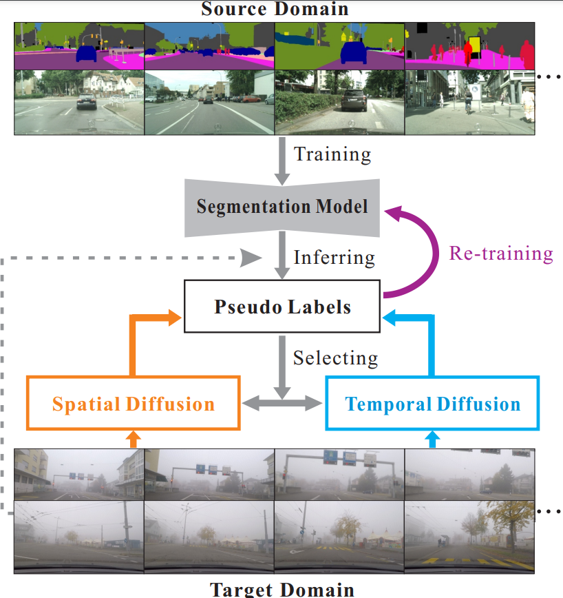
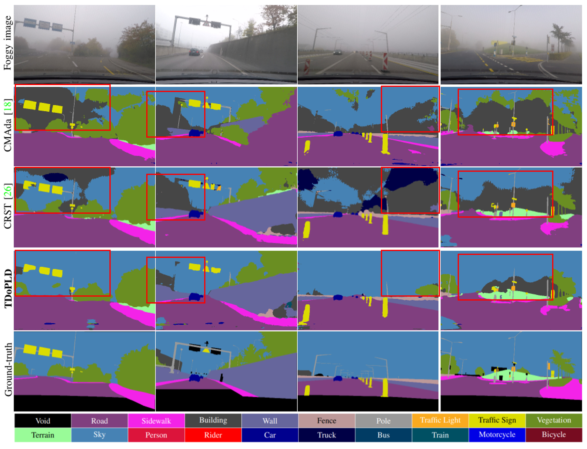
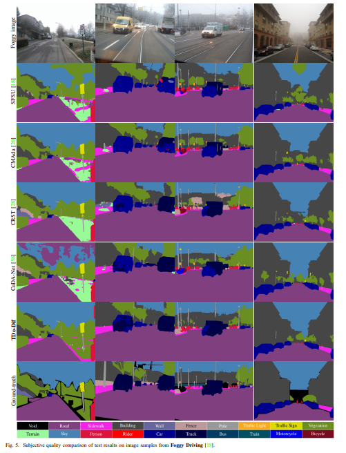

# TDo-Dif



This is a [PyTorch](http://pytorch.org/) implementation of CanDA

English | [中文](./README_cn.md)

## Installation

There are two installation options you can choose from:

1. Install according to the env.yml provided in the repository, assuming you have anaconda3 installed
   
   ```bash
   conda env create -f env.yml
   ```

2. Install the required libraries manually, the required dependencies are (may contain unnecessary libraries)
   
   ```yml
   conda:
       python=3.7.10
       pytorch=1.7.1
       torchaudio=0.7.2
       torchvision=0.8.2
       numpy=1.20.2
   pip:
       imageio==2.9.0
       matplotlib==3.4.2
       natsort==7.1.1
       opencv-python==4.5.2.54
       scipy==1.7.0
       visdom==0.1.8.9
       tqdm==4.61.1
       scikit-learn==0.24.2
       scikit-image==0.18.2
   ```

## Dataset Preparation

- **Cityscape** Dataset
  
  You can download this dataset from the [official website](https://www.cityscapes-dataset.com/) and unzip it, the structure of this dataset is

  ```
  /cityscapes
      /gtFine
      /leftImg8bit
  ```

- **Foggy Zurich** and **Foggy Driving** dataset
  
  Both datasets can be downloaded from the author's [website](https://people.ee.ethz.ch/~csakarid/Model_adaptation_SFSU_dense/)
  the structure of **Foggy Zurich** is
  
  ```
  /Foggy_Zurich
      /gt_color
      /gt_labelIds
      /gt_labelTrainIds
      /lists_file_names
      /RGB
  ```
  
  the structure of **FoggyDriving** is
  
  ```
  /Foggy_Driving
      /gtCoarse
      /gtFine
      /leftImg8bit
      /lists_file_names
      /scripts
  ```

## Test

| Model         | Network   | Dataset       | mIoU  | BaiduYun                                                                                                          |
|:-------------:|:---------:|:-------------:| ----- | ----------------------------------------------------------------------------------------------------------------- |
| base model    | RefinNet  | Foggy Zurich  | 40.02 | [link](https://pan.baidu.https://pan.baidu.com/s/1Z0Cl5yAxSqHYwXmzfAxtAgcom/s/1Z0Cl5yAxSqHYwXmzfAxtAg) code: zz6z |
| TDo-Dif-zurich  | RefinNet  | Foggy Zurich  | 51.84 | [link](https://pan.baidu.com/s/1z7VvPp6xztd4bvRuLgzuNg) code: mbb5        

After downloading the dataset and the model in the table above, run the following code, note that target_dataset is one of three choices, **target_data_root** and **source_data_root** are the paths of your dataset, and **ckpt** is the path of your model

```bash
python main.py --source_dataset cityscapes --source_data_root your_citiscapes_dataset_path --target_dataset FoggyDriving|FoggyZurich|ACDC --target_data_root your_target_dataset_path  --gpu_id 0 --batch_size 1 --val_batch_size 1 --ckpt checkpoints/xxx.pth --save_val_results --model refineNet --test_only --usegpu
```

## Training

Download the appropriate dataset, along with the model, and run the following code

```bash
python main.py --source_dataset cityscapes --source_data_root your_citiscapes_dataset_path --target_dataset FoggyDriving|FoggyZurich|ACDC --target_data_root your_target_dataset_path  --gpu_id 0 --batch_size 1 --val_batch_size 1 --ckpt checkpoints/xxx.pth --epoch_one_round 10 --save_val_results --model refineNet --usegpu --save_model_prefix none --train_type CRST_sp_with_loss_lp_constract --seg_num 500 --init_target_portion 0.2 --round_idx 0
```

In fact the training process is divided into two phases, the first phase generates and processes the pseudo tags, the second phase starts the training, if you only want to finish the first phase you can add `--only_generate`, if you have already finished the first phase you can add the following parameters to skip the first phase `--skip_thresh_gen --skip_p_gen --skip_sp_extend`

The **Foggy Zurich** dataset is a bit special in that it needs to be trained on two separate concentrations of fog, and the example code for training on light fog is

```bash
python main.py --source_dataset cityscapes --source_data_root your_citiscapes_dataset_path --target_dataset FoggyZurich --target_data_root your_target_dataset_path  --gpu_id 0 --batch_size 1 --val_batch_size 1 --ckpt checkpoints/xxx.pth --epoch_one_round 10 --save_val_results --model refineNet --usegpu --save_model_prefix none --train_type CRST_sp_with_loss_lp_constract --seg_num 500 --init_target_portion 0.2 --round_idx 0 --train_dataset_type light
```

When training on the medium fog, the pseudo-labels on the light fog need to participate in the training together, so you need to make the pseudo-labels of the light fog first.

```bash
python main.py --source_dataset cityscapes --source_data_root your_citiscapes_dataset_path --target_dataset FoggyZurich --target_data_root your_target_dataset_path  --gpu_id 0 --batch_size 1 --val_batch_size 1 --ckpt checkpoints/xxx.pth --epoch_one_round 10 --save_val_results --model refineNet --usegpu --save_model_prefix none --train_type CRST_sp_with_loss_lp_constract --seg_num 500 --init_target_portion 0.2 --round_idx 0 --train_dataset_type light --only_generate
```

Then run:

```bash
python main.py --source_dataset cityscapes --source_data_root your_citiscapes_dataset_path --target_dataset FoggyZurich --target_data_root your_target_dataset_path  --gpu_id 0 --batch_size 1 --val_batch_size 1 --ckpt checkpoints/xxx.pth --epoch_one_round 10 --save_val_results --model refineNet --usegpu --save_model_prefix none --train_type CRST_sp_with_loss_lp_constract --seg_num 500 --init_target_portion 0.2 --round_idx 0 --train_dataset_type medium --light_pseudo_label_path results/foggyzurich_prefix_round_0_light_CRST_sp/500_muti_views_labels_intra
```

## Results

The results on the three datasets (containing the results for each class) are as follows




